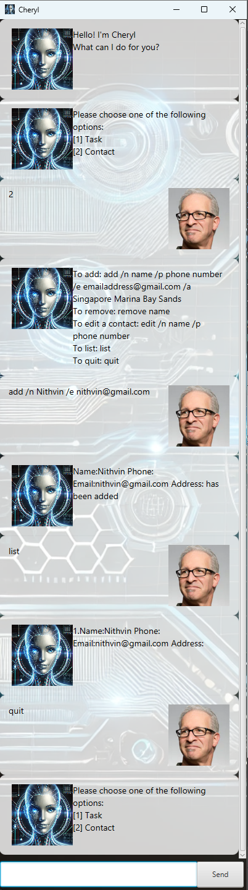

# Cheryl User Guide

// Update the title above to match the actual product name

// Product screenshot goes here


// Product intro goes here
Cheryl Chatbot is your personal manager for your tasks and your contacts.

> “Your mind is for having ideas, not holding them.” – David Allen ([source](https://dansilvestre.com/productivity-quotes))

Ever wanted an assistant but couldn't afford to hire one? Worry not CherylBot is here!

- text-based
- easy to learn 
- time ~consuming~ saving

All you need to is,
1. Download from [here.](https://github.com/NightlyAffair/ip)
2. double-click it.
3. add your tasks.
4. Let it manage your tasks & contacts for you 😉

And you can do all of this for **FREE!**

Features:

- [X] Managing Todos
- [X] Managing Deadlines
- [X] Manging Events
- [X] Managing Contacts

To run the program simply type 
`java jar Cheryl.jar`


## Adding deadlines
To add a deadline task, use the `deadline` command followed by the task description and the `/by` keyword with the due date and time.  

The task will be added to your list with a `[D]` tag, indicating it is a deadline task. The system will confirm the addition and display the updated task count.  

Example: `deadline return book /by 2/12/2019 1800`

```
Got it. I've added this task:  
\
**[D][ ] return book (by: Dec/02/2019 1800)**  
\
Now you have 1 task in the list.
```

## Adding todos
To add a to-do task, use the `todo` command followed by the task description.  

The task will be added to your list with a `[T]` tag, indicating it is a to-do task. The system will confirm the addition and display the updated task count.  

Example: `todo borrow book`

```
Got it. I've added this task:  
\
**[T][ ] borrow book**  
\
Now you have 1 task in the list.
```

## Adding events

To add an event task, use the `event` command followed by the task description, the `/from` keyword with the start date and time, and the `/to` keyword with the end date and time.  

The task will be added to your list with an `[E]` tag, indicating it is an event task. The system will confirm the addition and display the updated task count.  

Example: `event project meeting /from 2/12/2019 1800 /to 2/12/2019 2000`  

```
Got it. I've added this task:  
\
**[E][ ] project meeting (from: Dec/02/2019 1800 to: Dec/02/2019 2000)**  
\
Now you have 1 task in the list.
```

## Adding contacts  
To add a contact, use the `add` command followed by the `/n` keyword for the name, `/p` for the phone number, `/e` for the email address, and `/a` for the address.  

The contact will be added to your list, and the system will confirm the addition.  

Example: `add /n John Doe /p 98765432 /e johndoe@gmail.com /a Singapore Marina`  

```
Name: John Doe Phone: 98765432 Email: johndoe@gmail.com Address: Singapore Marina has been added
```

## Editing contacts  
To edit a contact, use the `edit` command followed by the ``/n` keyword for the name, `/p` for the phone number, `/e` for the email address, and `/a` for the address.  

The system will update the contact details and confirm the changes.  

Example: `edit /n John Doe /p 91234567`  

```
Name: John Doe Phone: 91234567 Email: johndoe@gmail.com Address: Singapore Marina has been updated
```

## Removing contacts  
To remove a contact, use the `remove` command followed by the `/n` keyword for the name.

The system will delete the contact confirm the changes.  

Example: `delete /n John`  

```
Name: John Doe Phone: 91234567 Email: johndoe@gmail.com Address: Singapore Marina has been removed
```


